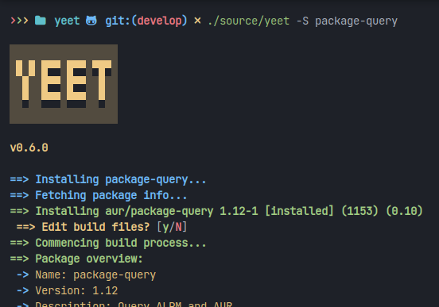

<div align="center">
  
</div>

<h1 align="center">
  <code>yeet</code>
</h1>

> a beautiful, easy-to-use aur helper and pacman wrapper, inspired by
> [several](https://aur.archlinux.org/pikaur) [amazing](https://aur.archlinux.org/pacaur)
> [projects](https://aur.archlinux.org/paru).
> 
> uses [`package-query`](https://aur.archlinux.org/package-query) to query
> packages from the sync repos and AUR.

## installation

### aur

If you already have an
[`aur` helper](https://wiki.archlinux.org/title/aur_helpers) installed, you can
install `yeet` from [`aur`](https://aur/archlinux.org/packages/yeet).

### install script

The script will perform the steps given in the
[manual installation section](#manual) for you. run the following in your
terminal:

```bash
> curl https://raw.github.com/gamemaker1/yeet/develop/assets/package/install | bash
```

### manual

performing a manual installation requires the following packages:

- [`git`](https://aur.archlinux.org/git)
- [`base-devel`](https://aur.archlinux.org/base-devel)

to perform the installation, run the following in your terminal:

```
> mkdir -p ~/.cache/yeet/build/
> cd ~/.cache/yeet/build/
> git clone https://aur.archlinux.org/package-query.git
> git clone https://aur.archlinux.org/yeet.git
> cd package-query
> makepkg -sfcCi
> cd ../yeet
> makepkg -sfcCi
> cd ~
```

## usage

`yeet` aims to be a beautiful, easy to use, and minimal aur helper + pacman
wrapper. it:

- can search for a package; and then install it (`yeet <search terms>`)
- can install a package from aur or the official repos
  (`yeet -S <package-name>`)
- allows you to edit build files before installing an aur package (default file
  manager is `ranger`; this can be changed)
- can build an aur package using its pkgbuild (`yeet -B <path to package dir>`)
- can remove a package and any unneeded dependencies (`yeet -R <package-name>`)
- can upgrade all packages (`yeet -U`)
- allows you to run common `pacman` operations
  (`yeet -<D/F/Q/T> [more pacman-specific options]`)
- can be configured easily - either through environment variables; or a config
  file. an example configuration is stored at `/usr/share/yeet/yeet.conf` once
  installed, and can be viewed [on-line](./assets/package/yeet.example.conf).

## contributing

Thank you for your interest in contributing to `yeet`!

you can contribute to `yeet` by spreading the word, spotting and fixing bugs,
and help adding new features. `yeet` is just a bash script, you may edit
[the file](./source/yeet) and submit a pull request. suggestions and pull
requests are welcome!

## license

this program and its associated files are all licensed under the gnu gpl v3
license.
