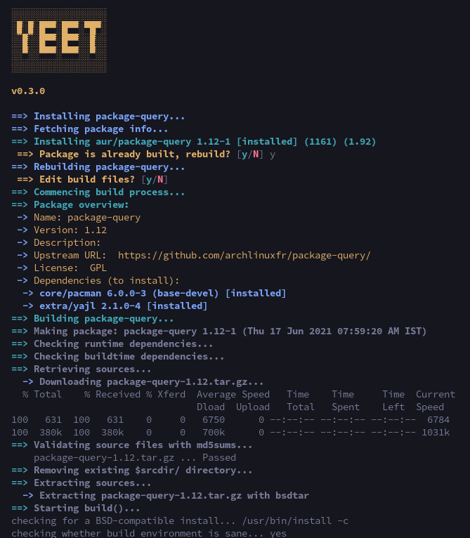

# YEET

Yet another minimal [pacman](https://wiki.archlinux.org/title/Pacman) wrapper. Yeet!

Inspired by several AMAZING projects: [`pacaur`](https://aur.archlinux.org/pacaur), [`pikaur`](https://aur.archlinux.org/pikaur), [`yay`](https://aur.archlinux.org/yay) and [`paru`](https://aur.archlinux.org/paru). Uses [`package-query`](https://aur.archlinux.org/package-query) to query packages from the sync repos and AUR.

## Preview

](./assets/media/install-process.png)

[Yeet installing package-query]

More images [here](./assets/media/).

## Installation

### AUR

If you already have an [AUR helper/pacman wrapper](https://wiki.archlinux.org/title/AUR_helpers) installed, you can install `yeet` from [AUR](https://aur/archlinux.org/packages/yeet).

### Install script

The script will perform the steps given in the [Manual Installation section](#manual) for you. Run the following in your terminal:

Using `cURL`:

```
curl https://raw.githubusercontent.com/gamemaker1/yeet/develop/assets/package/install | bash
```

Using `wget`:

```
wget https://raw.githubusercontent.com/gamemaker1/yeet/develop/assets/package/install -O - | bash
```

### Manual

Requires:

- [git](https://aur.archlinux.org/git) [`pacman -S git`]
- [base-devel](https://aur.archlinux.org/base-devel) [`pacman -S base-devel`]

Clone the AUR package and build yeet:

```
mkdir -p ~/.cache/yeet/build/
cd ~/.cache/yeet/build/
git clone https://aur.archlinux.org/yeet.git
cd yeet
makepkg -sfcCi
```

## Usage and configuration

`yeet` is aims to be a minimal pacman wrapper. It has the following features:

- Search for a package; and then install it (`yeet <package search terms>`)
- Install a package (`yeet -S <package-name>`)
- Remove a package (`yeet -R <package-name>`)
- Build an AUR package using its PKGBUILD (`yeet -B <path to package dir>`)
- Upgrade all packages (`yeet -U`)
- Run pacman -D (`yeet -D [options]`)
- Run pacman -F (`yeet -F [options]`)
- Run pacman -Q (`yeet -Q [options]`)
- Run pacman -T (`yeet -T [options]`)

`yeet` can be configured using its config file, located at `$XDG_CONFIG_HOME/yeet/yeet.conf` OR `$HOME/.config/yeet/yeet.conf`. [Here](./assets/package/yeet.example.conf) is an example configuration.

## Contributing

Thank you for your interest in contributing to `yeet`!

You can contribute to `yeet` by spreading the word, spotting and fixing bugs, and help adding new features. `yeet` is just a bash script, you may edit [the file](./source/yeet) and submit a pull request. Suggestions and PRs welcome!

## License

### GNU GPL v3

Copyright (C) 2021 Vedant K (gamemaker1) \<gamemaker0042 at gmail dot com\>

This program is free software: you can redistribute it and/or modify
it under the terms of the GNU General Public License as published by
the Free Software Foundation, either version 3 of the License, or
(at your option) any later version.

This program is distributed in the hope that it will be useful,
but WITHOUT ANY WARRANTY; without even the implied warranty of
MERCHANTABILITY or FITNESS FOR A PARTICULAR PURPOSE. See the
GNU General Public License for more details.

You should have received a copy of the GNU General Public License
along with this program. If not, see <https://www.gnu.org/licenses/>.
